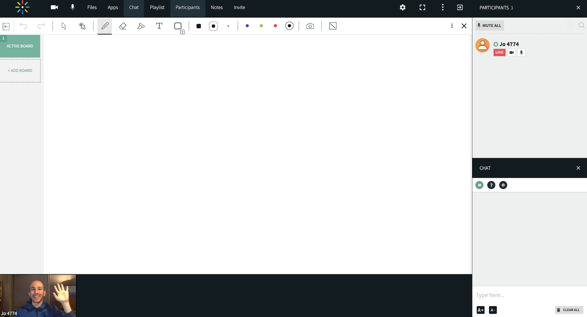

# Minimal Virtual Room

This is a minimal web app to demonstrate in as few steps as possible the Kaltura/NewRow virtual meeting API . This example leverages the easy-to-use [Virtual Meeting Room API](https://github.com/kaltura-vpaas/virtual-meeting-rooms) to host the meeting on the Kaltura platform.

## Getting Started

### Video Walkthrough:

[http://www.kaltura.com/tiny/w86qx](http://www.kaltura.com/tiny/w86qx)

### Prerequisites

1. [Nodejs](https://nodejs.org/en/) 
2. [Kaltura VPaaS account](https://corp.kaltura.com/video-paas/registration?utm_campaign=Meetabout&utm_medium=affiliates&utm_source=GitHub). Once you've opened an account, send an email to <VPaaS@kaltura.com> to activate Meetings.

### Install and Run

1. Clone the github repo: https://github.com/kaltura-vpaas/minimal-virtual-room-nodejs
2. Run `npm install`
3. Copy `.env.template` to `.env` and populate the following required fields (other fields in the file are not required to run this app):

```env
KALTURA_SERVICE_URL=https://www.kaltura.com 
KALTURA_ADMIN_SECRET= #obtained from https://kmc.kaltura.com/index.php/kmcng/settings/integrationSettings 
KALTURA_PARTNER_ID=#obtained from https://kmc.kaltura.com/index.php/kmcng/settings/integrationSettings 
KALTURA_USER_ID=#set it to the Kaltura user designated as admin. This is usually the email address you used to create your Kaltura account 
```

4. Run the app: `npm start`

   

## A Meeting!

## 

### Setting Up a Meeting: Beneath the Hood

A Kaltura virtual meeting room is created and joined through a series of API calls, described in detail in the [integration guide](https://github.com/kaltura-vpaas/virtual-meeting-rooms). The [Virtual Room Manager App](https://github.com/kaltura-vpaas/liveroom_manager) is another helpful tool to understand its usage.

Now, let's walk through the Meetings API

To create a new meeting, look at the `POST` handler in `/routes/index.js` which calls the `createRoom` function in [/lib/createroom.js](https://github.com/kaltura-vpaas/meetabout/blob/master/lib/createroom.js):

```javascript
 createRoom(topicName, function (kalturaResponse) {
```

`kaltura.services.session.start` creates a [Kaltura Admin Session](https://github.com/kaltura-vpaas/virtual-meeting-rooms#creating-an-admin-session) which is needed to [create the virtual room](https://github.com/kaltura-vpaas/virtual-meeting-rooms#creating-a-resource):

```javascript
// Create the virtual room
let scheduleResource = new kaltura.objects.LocationScheduleResource();
scheduleResource.name = topicName;
scheduleResource.tags = "vcprovider:newrow";

kaltura.services.scheduleResource.add(scheduleResource)
.execute(client)
```

The call to `kaltura.services.scheduleResource.add(scheduleResource)` creates a `resource`, which is Kaltura's terminology for a virtual room. The resource has an ID which is then passed to `joinRoom`

```javascript
/* POST */
router.post('/', function (req, res, next) {
  createRoom("A Room Name", function (kalturaResponse) {
    console.log("creating room");
    joinRoom(kalturaResponse.id,
      req.body.firstName,
      req.body.lastName,
      req.body.email, function (joinLink) {
        res.redirect(joinLink);
      });
  });
});
```

The virtual meeting room has now been created and is ready to be used!

### Joining the Virtual Meeting Room

Some preparation is needed to join the `resource` or virtual meeting room. The room needs to know your identity and your user type. Kaltura can designate meeting users as either admins or viewers and you can reference https://github.com/kaltura-vpaas/liveroom_manager for a more in depth example differentiating the user types.

In order to identify a user to the room, we need to create a [Kaltura Session](https://github.com/kaltura-vpaas/virtual-meeting-rooms#creating-a-kaltura-session) with some metadata related to the Virtual Meeting Room API.

`  joinRoom(kalturaResponse.id, user.name, user.email, function (joinLink) {`

This then calls [/lib/joinroom.js](/lib/joinroom.js) to create a [Kaltura Session](https://github.com/kaltura-vpaas/virtual-meeting-rooms#creating-a-kaltura-session) and authenticates the user that clicked the "Join Meeting" button.

The URL scheme for the room follows the [convention for virtual meeting rooms](https://github.com/kaltura-vpaas/virtual-meeting-rooms#creating-the-virtual-meeting-room-url) and is created in [/lib/joinroom.js](/lib/joinroom.js):

```javascript
let roomUrl = "https://" + partnerId + ".kaf.kaltura.com/virtualEvent/launch?ks=" + result;
```

The `ks` is a string representing the `Kaltura Session` for the user for this meeting room. And the `partnerId` is your Kaltura VPaaS account's partner ID. 

And that is it! The URL is ready to use to join the room! It is passed back to the meeting webpage and into the *href* of the "Join Meeting" button!  
And btw, you can also embed this link in an iframe or an email or anywhere you would like to integrate a live meeting!